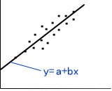
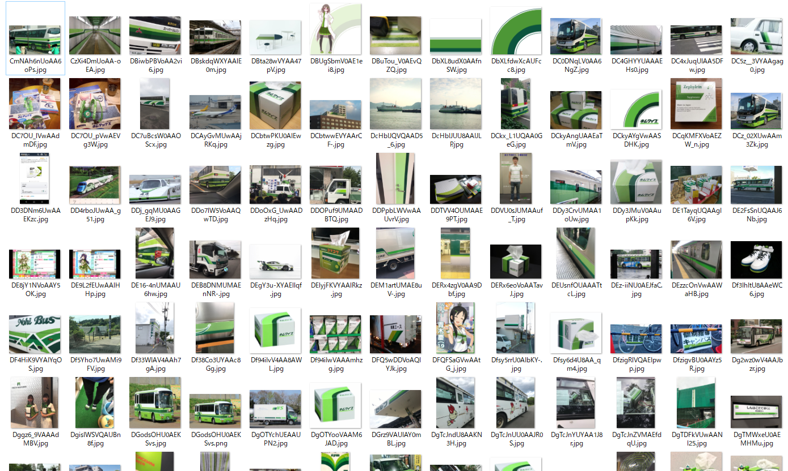
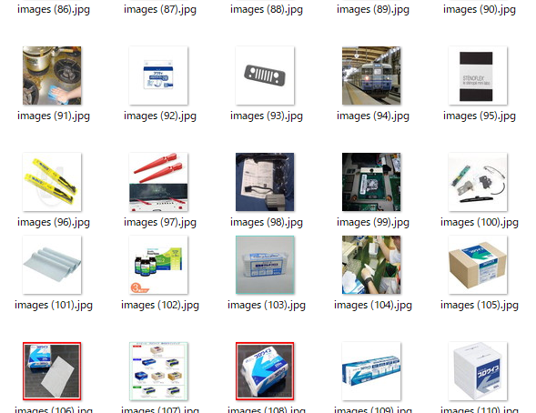
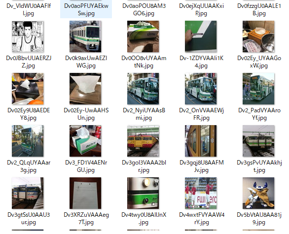
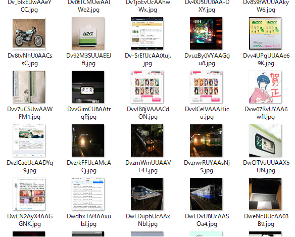
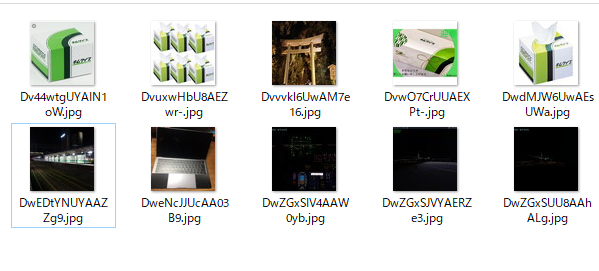
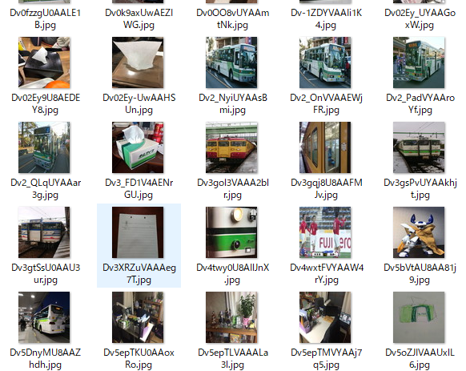
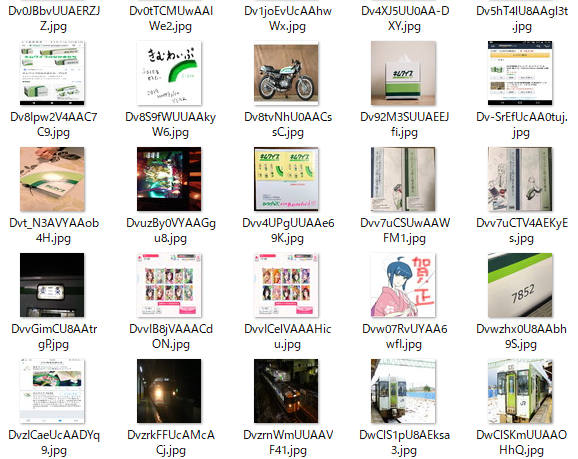

305号室 4年 崎下雄稀

# 機械学習でキムワイプを認識する
卒業研究で機械学習をやっているのでキムワイプの画像認識をやってみることにしました

## What is 機械学習？
> 人工知能における研究課題の一つで、人間が自然に行っている学習能力と同様の機能をコンピュータで実現しようとする技術・手法のことである。
--Wikipedia 「機械学習」より

内容がまったくもって伝わってこないが，一定のアルゴリズムで問題を解決しようという課題である．  
  
最も簡単なものは$(x,y)$のデータの集合が与えられそこから回帰直線を求めるような場合である(図)．$y=ax+b$という関数のパラメータ$a,b$を調整して一番それらしいものを計算によって求める．  
予測に使う関数や「それらしさ」の測り方によっていろいろな手法がある．

今回は，写真がそれぞれキムワイプであるかそうでないかというデータを与え，Random Forest という手法で予測を行う．

## データ収集
私は日夜ツイッターでキムワイプっぽい画像を検索しては収集しているのでキムワイプの画像には事欠かない．全部で426枚のキムワイプ，またはキムワイプっぽい画像があった．  
  
また，キムワイプではない画像も必要なのでGoogleから適当に同数程度取ってくる．  


## データ加工
機械学習では予めデータに手を加え，扱いやすい形に整えることも重要である．  
今回は画像処理ソフトで64×64pxの正方形に変形，圧縮し一律に64×64×RGB3色=12288次元のデータとして扱った．

## 学習
計算はPythonの機械学習用ライブラリ，scikit-learnを用いた．このライブラリを使えば学習は簡単で，

```py
clf = RandomForestClassifier(<パラメーター>)
clf.fit(<学習データ>, <分類の正誤表>)
```
と書くだけで計算できる．
実際はデータを訓練用データとテスト用データに分けて予測性能を評価し，パラメータを調整する必要があるがRandomForest はほぼ調整なしで良い性能が出るので適当に決めて実行する．

これで学習の終わった分類器で画像を分類してみる．
ツイッターで「キムワイプ」で検索して適当に取ってきた画像をキムワイプかそうでないかに分類させる．
結果は以下の通り．

+ キムワイプ  
    
+ キムワイプでない  
    

明らかにキムワイプな写真が「キムワイプでない」に分類されている．また，「キムワイプ」に分類された画像も全然キムワイプらしくないものが多く分類器としては不満の残るものとなった

## 改良
ここまではキムワイプの画像とキムワイプっぽい画像はすべてキムワイプ扱いで学習したが，このような分類問題では似た属性でもなるべく細かくラベル付けすると性能がよくなるという定跡がある．
というわけでキムワイプ組を**手作業で**「キムワイプ」と「キムワイプっぽい画像」に分類し，再度学習させてみる．
結果が以下の通り．
+ キムワイプ  
    
+ キムワイプっぽい  
    
+ キムワイプでない  
    

残念ながら今回もキムワイプの写真が「キムワイプでない」に分類されてしまった．思えば学習データにはキムワイプの正面写真はなかったかもしれない．
なんとなく，普通のアングルのキムワイプの写真とキムワイプっぽい配色で有名な「二次新潟色の115系電車」は一通り分離できている感じがあるので一応の成功ということにしておく．

## まとめと今後の課題
時間の問題であまり性能向上させることができず不十分な結果となってしまった．
実は最近話題のディープラーニングも試してみたのだがこちらはパラメータの調整が難しいのと計算にかなり時間がかかるため良い精度は得られなかった．
今後はより適切な学習アルゴリズムの探索やデータの前処理の向上と詳細な訓練データのラベリング等でより実用的な画像認識システムの開発を課題としたい．（まだ2年あるので．）